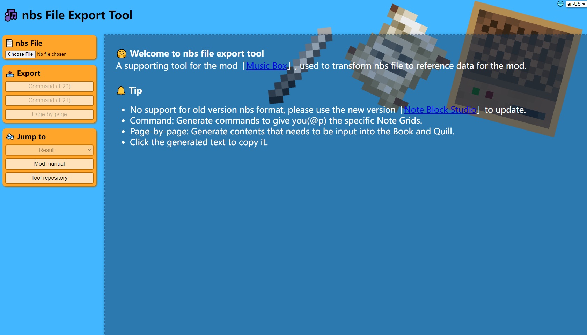

# Music Box Tool

A supporting tool for the mod「[Music Box](https://github.com/C20C01/MusicBox)」, used to transform nbs file to reference
data for the mod.

## How to use

1. Visit the [tool page](https://c20c01.github.io/MusicBoxTool/).
2. Click the "Choose File" button to select a nbs file.
3. Choose the export type and click the corresponding button:
    * **Command**: Generate commands to give you(@p) the specific Note Grids.
    * **Page-by-page**: Generate contents that needs to be input into the Book and Quill.
4. Copy the generated content and paste it into the corresponding location in the game:
    * **Octave** {-2, 0, 2}: This Note Grid should be loaded into the Music Box with the specified octave offset.
    * **Index**: Because the Note Grid has a maximum of 64 pages, the Index is used to distinguish between different
      Note Grids that should be loaded into the same Music Box.
    * **Page**: The page number of the Book and Quill that needs to be input, there may be empty pages in between, so
      please check the page number carefully.

## Get nbs file

* You can use the [Note Block Studio](https://github.com/OpenNBS/NoteBlockStudio) to create a nbs file or convert a midi
  file to a nbs file.
* You can also visit the [Note Block World](https://github.com/OpenNBS/NoteBlockWorld), where you can find a lot of nbs
  files created by other players, they were shared under different licenses, please check it before using.

## Performance effect

Export will discard the volume and pan information, so the performance effect will be different from the original nbs
file.

## Example

**WIP**